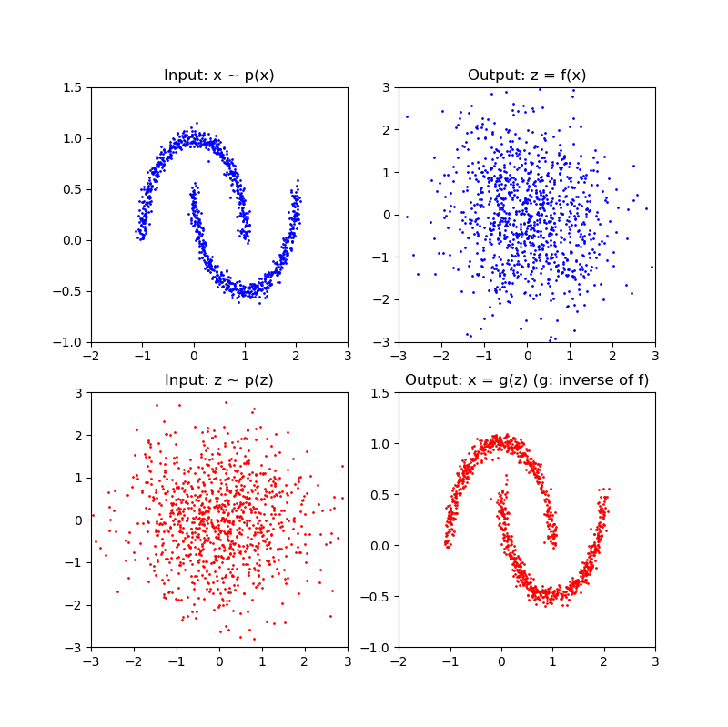

# Real NVP for Two Moons
PyTorch implementation of Real NVP for Two Moons

## Description
This is implementation of real-valued non-volume preserving(real NVP) for Density Estimation(real NVP). I used Two Moons dataset of sklearn and tried to reproduce fig.1 in the paper. 

## Results
The following results were obtained with the default setting. (command: python main.py)

<table align='center'>
<tr align='center'>
<td> Result </td>
</tr>
<tr>
<td></td>
</tr>
</table>

## References
The implementation is based on:  
[1] https://arxiv.org/abs/1605.08803  
[2] https://github.com/senya-ashukha/real-nvp-pytorch  

